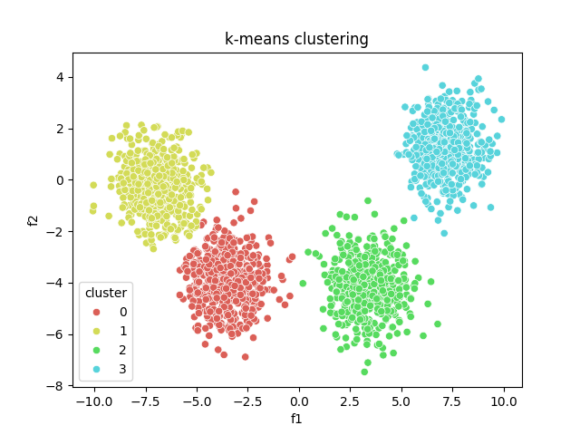

# K-means Clustering Project

This repository contains a C++ implementation of the K-means clustering algorithm. The project is structured to separate source code, build artifacts, and data files for easy navigation and use.

## Building the Project

Ensure you have CMake installed on your system. To build the project:

1. Navigate to the root directory of the project.
2. Create a `build` directory and navigate into it:
   ```bash
   mkdir build && cd build
   ```
3. Run CMake and then make:
   ```bash
   cmake ..
   make
   ```
4. The executable will be located in the `exec/` directory.

## Running the Program

### On Unix-based Systems (Linux, macOS)

After building, run the K-means clustering program:
   ```bash
   cd ../exec/
   ./kmeans
   ```

### On Windows
After building,run the K-means clustering program:
   ```bash
   cd ../exec/
   kmeans.exe
   ```

## Plotting the Results

Run the implemented Python script (`plot.py`) to visualize the results:

1. Ensure Python is installed on your system.
2. Navigate to the directory containing `plot.py`. If it's in the parent directory of `exec`, use:
   ```bash
   cd ..
   ```
3. Install the required Python packages:
   ```bash
   pip install -r requirements.txt
   ```
4. Run the script:
   ```bash
   python plot.py
   ```

<p align="center">
  
  <br style="italic">
  <em>Plotting result : k-means clustering with 4 clusters using data.csv<em>
</p>

## Data Format

The `data.csv` file should be in a format compatible with the K-means implementation. Typically, this would be a CSV file with numerical data points.

<table align="center">
   <tr>
      <td>f1</td>
      <td>f2</td>
      <td>...</td>  
      <td>fn</td>
   </tr>

   <tr>
      <td>35.19</td>
      <td>12.189</td>
      <td>...</td>
      <td>11.839</td>
   </tr>

   <tr>
      <td>26.288</td>
      <td>41.718</td>
      <td>...</td>  
      <td>23.832</td>
   </tr>

   <tr>
      <td>0.376</td>
      <td>15.506</td> 
      <td>...</td>
      <td>13.264</td>
   </tr>

   <tr>
      <td>...</td>
      <td>...</td>
      <td>...</td>
      <td>...</td>  
   </tr>
</table>

 
Data download from: [ieee-dataport](https://ieee-dataport.org/open-access/gaussian-blobs-varying-numbers-samples-centers-and-features)

After running the program, the results will be written to `output.csv`. This would be a CSV file with the following format: 

<table align="center">
   <tr>
      <td>f1</td>  
      <td>f2</td>
      <td>...</td>
      <td>fn</td>
      <td>cluster</td>
   </tr>

   <tr>
      <td>35.19</td>   
      <td>12.189</td> 
      <td>...</td>
      <td>11.839</td>
      <td>0</td>
   </tr>

   <tr>
      <td>26.288</td>  
      <td>41.718</td>
      <td>...</td>
      <td>23.832</td>
      <td>2</td>
   </tr>

   <tr>
      <td>0.376</td>   
      <td>15.506</td>
      <td>...</td>
      <td>13.264</td>
      <td>0</td>
   </tr>

   <tr>
      <td>...</td>
      <td>...</td>
      <td>...</td>    
      <td>...</td>
      <td>...</td>
   </tr>
</table>


## Contributing

Feel free to fork this repository and submit pull requests to contribute to this project.

## License

This project is licensed under the terms of the GNU General Public License.

## Project Structure

```plaintext
K-means clustering
├─ src
│  ├─ k-means.cpp
│  └─ k-means.h
├─ data
│  ├─ data.csv
│  ├─ small_data_f2_c3.csv
│  └─ output.csv
├─ exec
│  └─ kmeans
├─ build
├─ CMakeLists.txt
├─ LICENSE
├─ README.md
├─ requirements.txt
├─ main.cpp
└─ plot.py
```